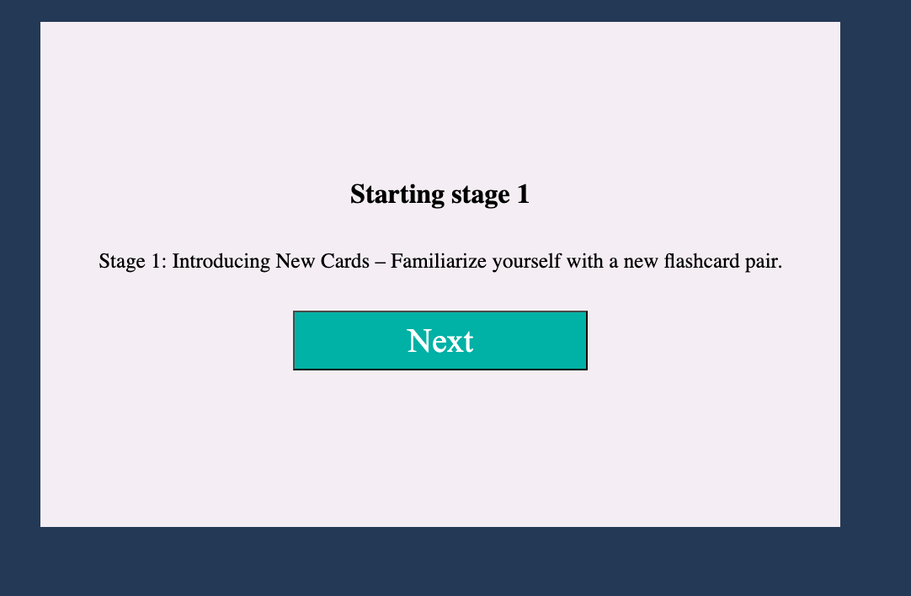

### Features
- Select flashcard sets from different subjects
- Interactive flashcard display with flipping functionality
- Multi-stage learning process to guide students through memorization

## Preview

Below are some images of the project in action:





## Tech Stack

**Languages and Tools:**
- **HTML & CSS**: Structure and styling for the web app
- **JavaScript/TypeScript**: Used for dynamic content and flashcard logic

## How I Built It

This project was an introduction to web development for me, and I focused on using HTML, CSS, and JavaScript/TypeScript to build the foundations of the app. It served as a playground to explore DOM manipulation and layout design.


## What's Next?

I'm currently working on **Version 2**, where I'll use React for improved state management and scalability. Version 2 will also include new features:
- Ability to create custom flashcards directly from the UI
- A more responsive design with additional CSS frameworks
- Improved performance through modern JavaScript frameworks

## Lessons Learned

Working on this project significantly improved my understanding of web development. I gained confidence in:
- Basic **JavaScript programming**: especially around interacting with the DOM and handling events.
- **TypeScript**: exploring its advantages for maintaining code quality.
- **Web development fundamentals**: understanding how to build a front-end project from scratch.

### Challenges & Growth

- **DOM Manipulation**: Learning how to interact with the DOM was one of the most challenging aspects. Through this project, I deepened my understanding of how browsers render and update pages.
- **TypeScript**: As my first time using TypeScript, I focused on its benefits like type safety and how it helps prevent runtime errors.

## How To Run Locally

1. Clone this repository:
    ```bash
    git clone https://github.com/yourusername/Flash-Learning.git
    ```
2. Navigate to the project folder:
    ```bash
    cd Flash-Learning
    ```
3. Open `index.html` in your browser to start using the app.